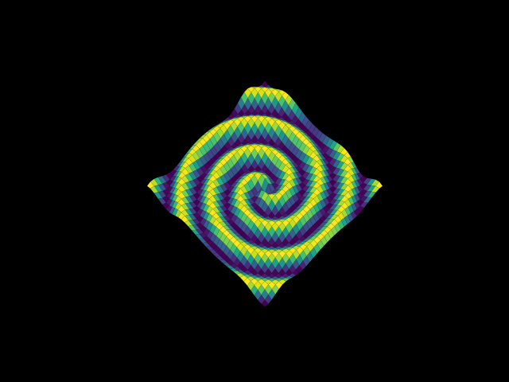

# Gravitational Waves Simulation

## Context
This simulation was created for the Bonja Science project where the students were given the task to search about a topic from the [article](http://www.sbfisica.org.br/rbef/pdf/363504.pdf)  and somehow present the topic that they have choosen to the other students.

## Tools
This simulation was conceived using the following tools:

* Python

    Python is the main language used in  this project.

* Matplotlib library

    Matplotlib was used for graphing the 4 dimensional function that represents the gravitational wave.

* Numpy library

    Numpy was used to transcribe the mathematical function $\ f(t,x,y) = cos( \pi \sqrt{x^2 + y^2} - \frac{ \pi t }{2})$ to code.

* Shell Script.

    Shell Script just execute `main.py` with the  desired comfiguration for the presentation.

    (naming a file "main" is a horrible ideia)