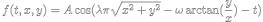

# Gravitational Wave Simulation

## Context
This simulation was created for the Bonja Science project where the students were given the task to research about a topic from the [article](http://www.sbfisica.org.br/rbef/pdf/363504.pdf) and somehow present the topic that they have choosen to the other students.

## Tools
This simulation was conceived using the following tools:

* Python

    Python is the main language used in  this project.

* Matplotlib library

    Matplotlib was used for graphing the 4 dimensional function that represents the gravitational wave.

* Numpy library

    Numpy was used to transcribe the mathematical function, , to code.

* Shell Script.

    Shell Script just execute the file with the desired comfiguration for the presentation.

